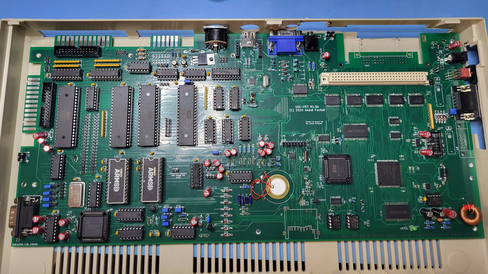

# Ulti-PET

Note: this is a part of a larger set of repositories, with [upet_family](https://github.com/fachat/upet_family) as the main repository.

This is a re-incarnation of the Commodore PET computer(s) from the later 1970s.

It is build on a PCB that fits into a C64-II case (with extra cutouts for connectors), and has only parts that can still be obtained new in 2024/2025.
A 3D-printed case is also available specific for the Ulti-PET PCB.

Videos on the machine are coming soon on the [YouTube 8-bit times](https://youtube.com/playlist?list=PLi1dzy7kw1iybjcUccgjCV4fhNH4IPWSx) channel.

## Features

The board is built with a number of features:

- Commodore 3032 / 4032 / 8032 / 8296 with options menu to select at boot
  - Boot-menu to select different PET versions to run (BASIC 1, 2, 4)
  - 40 and 80 col character display
  - 8296 memory map emulation
  - IEEE488 interface (card edge and 24pin flat ribbon cable)
  - Tape connector (card edge, incl. 9V for proper tape operation)
  - PET graphics keyboard, or alternatively a C64 keyboard
- Improved system design:
  - 512k video RAM, plus 512k fast RAM, accessible using banks on the W65816 CPU
  - boot from an SPI Flash ROM
  - up to 13.5 MHz mode (via configuration register)
  - Write protection for the PET ROMs once copied to RAM
  - lower 32k RAM mappable from all of the 512k fast RAM
  - single 5V power supply (<1A) using USB-C connector
  - hardware and firmware support SD-Card and USB keyboard or mouse
- Improved Audio output:
  - Original beeper sound
  - Audio output using a DAC with DMA
  - Dual SID output
  - beeper, DAC, and SID are mixed into a stereo line output
  - integrated amplifier can drive <1W speakers
- Improved Video output:
  - VGA colour video output (222 RGB)
  - up to 96x72 characters on screen
  - hires modes up to a 720x576 resolution
  - 16 out of 64 colour palette, Colour-PET or C128 VDC-compatible, Sprites
  - Hires graphics mode (using a configuration register)
  - modifyable character set
  - multiple video pages mappable to $8000 video mem address
- Extra I/O features:
  - Userport Joystick, software-switchable between single and dual joystick configs
  - fast serial IEC for Commodore's 1581 or 1571 disk drives (ROM support TBD)
  - 5V SPI interface for further extensions
  - 3.3V SPI interface for further extensions
  - Adafruit(tm) UEXT interface for further extensions (SPI shared with 3.3V SPI, includes I2C)
  - Dual UART serial, one RS232, one TTL (shared with UEXT, or the USB-C-to-serial)

## Overview

The system architecture is actually rather simple, as you can see in the following graphics.

The main functionality is "hidden" inside the FPGA. It does:

1. clock generation and management
2. memory mapping
3. video generation.
4. SPI interface and boot
5. DAC DMA

On the CPU side of the FPGA it is actually a rather almost normal 65816 computer, 
with the exception that the bank register (that catches and stores the address lines 
A16-23 from the CPU's data bus) is in the FPGA, and that there is no ROM. The ROM has been
replaced with some code in the FPGA that copies the initial program to the CPU accessible
RAM, taking it from the Flash Boot ROM via SPI. This actually simplifies the design,
as 

1. parallel ROMs are getting harder to come by and
2. they are typically not as fast as is needed, and
3. with the SPI boot they don't occupy valuable CPU address space.

The video generation is done using time-sharing access to the video RAM.
The VGA output is 720x576 at 50Hz, or 720x480 at 60 Hz. So there is a pixel clock of 27MHz.

The system runs at 13.5MHz, so a byte of pixel output (i.e. eight pixels) has four
memory accesses to VRAM. Two of them are reserved for video access, one for fetching the
character data (e.g. at $08xxx in the PET), and the second one to fetch the "character ROM"
data, i.e. the pixel data for a character. This is also stored in VRAM, and is being loaded
there from the Flash Boot ROM by the initial boot loader.

The FPGA reads the character data, stores it to fetch the character pixel data, and streams
that out using its internal video shift register.

For more detailled descriptions of the features and how to use them, pls see the 
[FPGA repository](https://github.com/fachat/upet_fpga) that contains the code for the FPGA,
as described in the next section.

## I/O included in the Ulti-PET

The Ulti-PET not just has the Ultra-CPU, but also loads of I/O on the one board:

### Standard PET IO

The Ulti-PET includes the standard PET I/O features using the VIA and two PIAs, with some extensions. So, it has:

- IEEE488, including flat ribbon cable and card edge connector; with the additional capability of working as a device too
- Tape#1 (incl. 9V for proper tape operation), incl. card edge connector
- Tape#2 as TTL, but normally re-used for IEEE488 device handling
- PET keyboard, with the option to use a C64 keyboard, and the extended Ultipet-Keyboard
- PET userport, with the Video signal (optionally) replaced with 5V to accomodate user port extensions; incl. card edge connector
- Joystick connectors for the userport, software-switchable between single- or dual mode (compatible with 'stupid pet tricks')
- Reset and diag push buttons

### RS232

A Dual UART chip provides two serial interfaces. One interface is a real RS232 with a
DB9 connector. The other one is TTL level interface (shared with UEXT, see below).

The USB-C power connector has an USB-to-serial converter, that can be jumpered to the 
TTL level interface.

### Fast IEC

An IEC interface is provided using a second VIA chip. Using the VIA shift register, fast mode IEC
(like in the C128) is implemented.

### Dual SID and sound mixer

Two SID chips are included for your stereo sound pleasure.

The two SID outputs are mixed with the DAC audio output from the Ultra-CPU base.
Also, the beeper sound is mixed into the overall sound output.

Two audio amps are included to, so speakers can be directly connected to the board
(switched off when the audio jack is used).

### Keyboard shift lock and reset

When the shift-lock key in the replacement keyboard is defined on a specific position in 
the keyboard matrix, the key works like a shift-lock key.

In addition, pressing the shift-lock key longer (a few seconds), resets the machine 
(as long as the keyboard scanning still works).

### CS/A expansion board

The board has a full width CS/A slot for a single expansion card, plus a short CS/A board for
the accompanying [CS/A Ultrabus]() Ultra-Bus expansion board. This allows using (compatible)
Apple-II, RC2014, and C64 cartridges with the Ulti-PET.

NOTE: In R1.2 and previous, the _short_ expansion bus had the wrong pinout - it needs DIN41612 reverse pinout! Therefore a "reverser adapter" needs to be used. This will be fixed in 1.3 forward.

### UEXT, and SPI-10 connectors

The board provides three standard I/O ports:

1. UEXT - this includes serial (see above), I2C, and SPI, all in 3.3V
2. SPI-10-3.3V - a 3.3V SPI interface for external modules (shared with UEXT)
3. SPI-10-5V - a 5V SPI interface provided by the second VIA, with selectable clock mode.

For the SPI-10 connectors see [here](http://forum.6502.org/viewtopic.php?f=4&t=4264&start=15#p48167).
For the UEXT connector see the Olimex [UEXT page](https://www.olimex.com/Products/Modules/UEXT/)

## Firmware features

Of the modern I/O, currently these are included and supported in the firmware, i.e. in the
BASIC4 models:

- USB keyboard or mouse support, if you select the boot option with a USB keyboard
- SD-Card support using the SD-Card filesystem from the Commander X16 provided by Michael Steil.
- C64 compatible kernal jump table

Note that if you select the boot option while holding the left shift key, a second optional 
configuration is being used.
For more details see the [ROM](https://github.com/fachat/upet_roms) repository, that contains
the current version of the firmware and accompanying documentation.
 
## Known Issues

The current revision is 1.3A

The known issues from the 1.2A version have been fixed.

## Revision history

1.3a: Update:
- fixes for 1.2a known issues included
- USB-C power supply connector, with USB-to-serial converter
- footprints for Joysticks improved and moved inwards
- footprint for VGA connector improved
- extended keyboard connector with I2C, and other lines
- extended pin header connectors for RS232
- improved pinout on FPGA to prep for HDMI (video output on differential pairs)
- optional pulldowns on audio out for original SIDs

1.2a: Update
- separate 3.3V generation for the bus, USB, and network, more bypass for SD cards
- Power, Shift Lock LED
- Remove 2nd oscillator option
- Digital video out connector for further experimentation
- Fix addressing of 2nd SID
- Replace some 1N4148 with 1N4448 for lower drop voltage, fix joystick diode direction
- Dual voltage divider for TTL beeper to avoid left/right audio crosstalk
- Fixes on the UART

1.1a: Update:
- Fixed userport joystick handling, allow software switching between single- and dual mode
- Include the beeper into the sound mixer
- Move from single UART to dual UART, to provide TTL serial or serial for UEXT
- Add I2C controller for UEXT
- Add UEXT, SPI-10-3.3V, SPI-10-5V connectors
- Add SPI interface with selectable modes on the second VIA (shares shift register with fast serial IEC bus)

1.0a: Initial release

## Building

Here are the subdirectories:

- [Board](Board/) that contains the board schematics and layout

Note that a case for the Ulti-PET is in the works - the case modifications for the Micro-PET do *not* work.

In addition, two other repositories are needed - they are separate as they are shared with other variants of the upet-family:

- [FPGA](https://github.com/fachat/upet_fpga) contains the VHDL code to program the FPGA logic chip used, and describes the configuration options - including the SPI usage, the DAC usage, and the Video features.
- [ROM](https://github.com/fachat/upet_roms) ROM contents to boot

### Board

To have the board built, you can use the gerbers that are stored in the zip file in the Board/production subdirectory.

To populate the board, there is an interactive bom (bill of materials) from KiCad, as well as the KiCad BOM CSV export in the [bom](Board/bom/) folder.

Parts numbers can be found in the [BOM list](Board/bom/cbm_ultipet_v1.2a-bom.xlsx). It has parts numbers for Mouser for all parts (except the SID), 
and for JLCPCB for the SMD parts. You can have JLCPCB assemble most of the SMD parts, and order the rest from Mouser. (Note, to not order parts twice, best
remove the JLPCB assembled parts before you upload to Mouser).

The BOM contains an Ethernet breakout board that is put into the connectors "above" the USB port. As an alternative you could use the 
[Wifi breakout board](https://github.com/fachat/upet_wifi). Note that at this time, this is not tested / programmed yet.

As an audio solution I am planning to use the Visaton K40SQ speakers, if you want to order them as well.

### FPGA

The FPGA is a Xilinx Spartan 6 programmable logic chip. It runs on 3.3V and it is programmed in VHDL.

To build the FPGA content, clone the [FPGA](https://github.com/fachat/upet_fpga) repository, and look for the ShellUPet.bin.
This needs to be programmed into the SPI flash chip containing the configration for the FPGA.

### ROM

To build the boot ROM image, clone the [ROM](https://github.com/fachat/upet_roms) repository, and build the spiimg70m file. This needs to be 
programmed into the SPI flash ROM containing the 65816 boot code.

The ROM image can be built using gcc, xa65, and make. Use your favourite EPROM programmer to burn it into the SPI Flash chip.

The ROM contains images of all required ROM images for BASIC 1, 2, and 4, and corresponding editor ROMs, including
some that have been extended with wedges.

The updated editor ROMs are from [Steve's Editor ROM project](http://www.6502.org/users/sjgray/projects/editrom/index.html) and can handle C64 keyboards, has a DOS wedge included, and resets into the Micro-PET boot menu.
For more details see the description in the ROM repository.

### Case

Currently no custom case is available.

## Gallery (R1.0)

 
